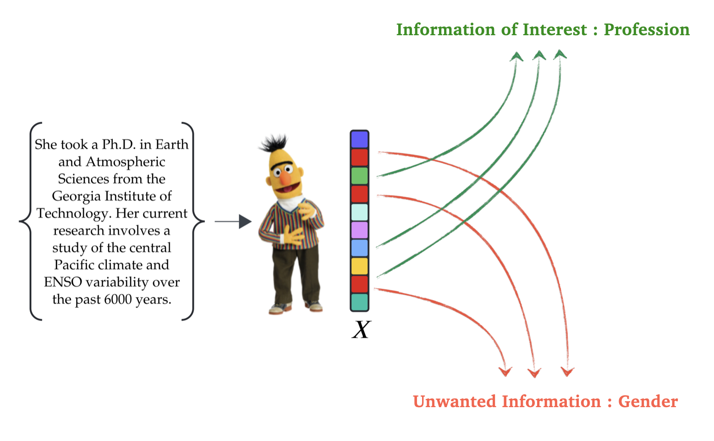
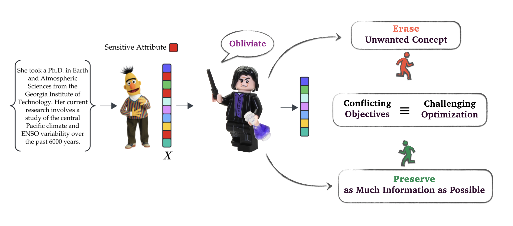
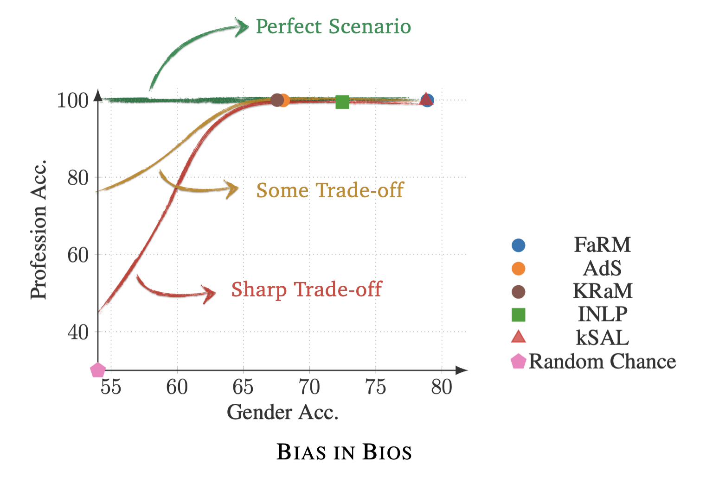
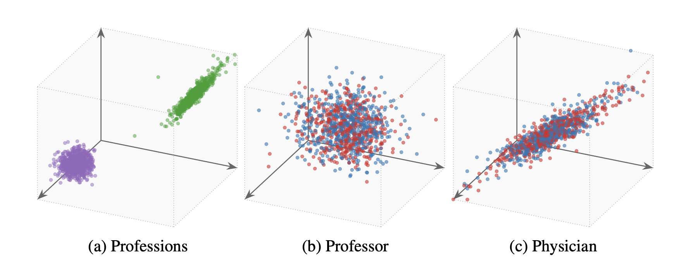
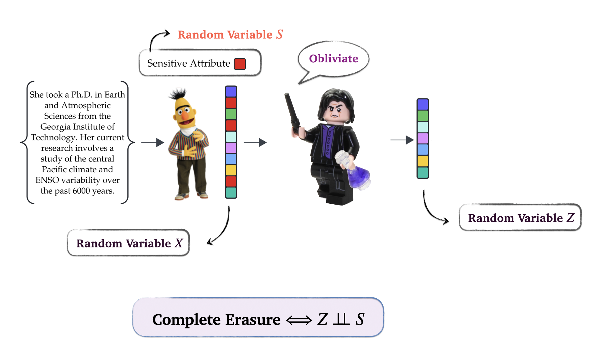
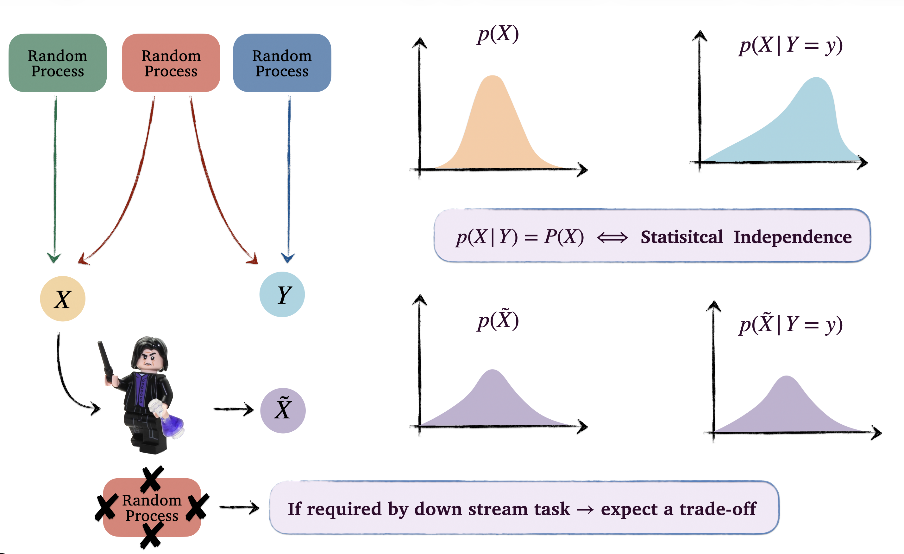
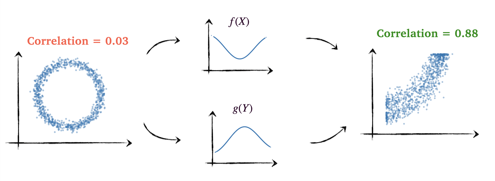
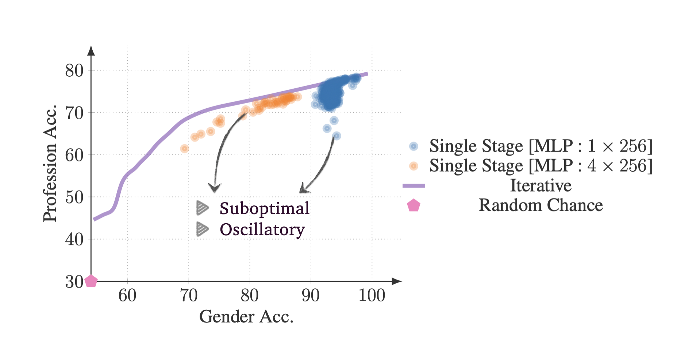
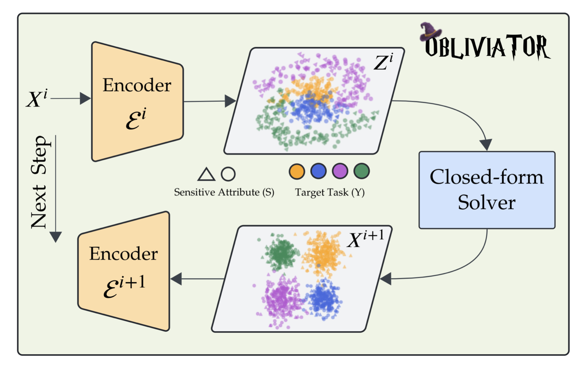

20 mins

## Concept Erasure and its Motivation
Concept erasure is a straightforward idea: we want to remove a specific concept from the learned representations of a model. In doing so, we must ensure that all other unrelated information in those representations remains untouched.
**But why would we need to erase something that has already been learned?**

Consider a scenario where CVs are processed through a language model to generate embeddings for a downstream machine learning task. How can we guarantee the model relies solely on professional information rather than gender features encoded within those embeddings? Without specific constraints, we cannot be certain that the algorithm's decision-making is free from unwanted information. **A guaranteed solution is to remove gender-related information from the embeddings before performing the analysis.**

::: {style="text-align: center;"}
{fig-align="center" width="50%"}
:::

We should also note that during the training of large-scale models, we have minimal control over the specific information they encode. Furthermore, different downstream tasks may necessitate the removal of different types of information. Since retraining a foundation model for every unique requirement is impractical, it is more effective to develop methods for controlling the information within learned representations. Concept erasure studies this control, which can be applied either during training or afterward. The latter approach, known as post-hoc erasure, is our focus here.

## Challenges in Concept Erasure
There are generally two challenges in concept erasure. First, we need a proxy to quantify how the unwanted concept and the learned representation are tied together. Second, we must delicately untie the unwanted information from the representation so that all unrelated information remains intact after erasure.

::: {style="text-align: center;"}
{fig-align="center" width="60%"}
:::

This makes the optimization problem for erasure quite difficult. On one hand, we want to remove information; on the other, we want to preserve information. Balancing these two competing objectives is challenging, and it is unlikely that, without a careful optimization setup, we will obtain a satisfactory result from this competition.

## Utility-Erasure Trade-off
To evaluate the practical challenges of concept erasure, we examine the performance of current methods. Ideally, if a representation is free of a specific attribute (e.g., gender), it should be impossible to classify that attribute from the embeddings. Consequently, if a classifier maintains substantial accuracy post-erasure, the process is incomplete. This failure typically stems from optimization complexities or an inadequate proxy for measuring the dependency between the representation and the unwanted attribute.

::: {style="text-align: center;"}
{fig-align="center" width="45%"}
:::

The figure illustrates gender erasure on the [BiasInBios](https://arxiv.org/abs/1901.09451){.advisor-link} dataset. While methods like [FaRM](https://aclanthology.org/2022.tacl-1.67/){.advisor-link} and [KSAL](https://aclanthology.org/2023.eacl-main.118/){.advisor-link} leak significant gender information, [KRaM](https://arxiv.org/abs/2312.00194){.advisor-link} and [AdS](https://aclanthology.org/2021.emnlp-main.43.pdf){.advisor-link} are more effective. However, their 68% accuracy remains notably higher than the 53% random-chance baseline (majority class) for this dataset.

It is very likely to see a decline in utility accuracy as a concept is erased, as we expect a trade-off between utility and erasure. This trade-off profile reveals the dynamics of the competition between information removal and preservation throughout the erasure process. Analyzing this profile, rather than a single point as the final step of erasure, provides a more comprehensive evaluation of the underlying optimization approach used to formulate the erasure problem. Furthermore, when total erasure significantly degrades downstream performance, we can select a specific point along this trade-off curve that offers a better balance between utility and the leakage of unwanted attributes.

## Nonlinear Guardedness {#sec-gaurd}
Now, let's examine what complete erasure looks like in practice. The figure below illustrates Obliviator's performance on the same dataset discussed earlier. These representations achieve approximately 62% accuracy for gender and 92% for profession.

::: {style="text-align: center;"}
{fig-align="center" width="55%"}
:::

On the left, we see the distribution for professions, specifically physicians (green) and professors (violet). The adjacent plots show the gender distribution within each profession. As illustrated, the gender distributions within each class completely overlap, leaving no gender-related variation. Now, we can guarantee no downstream model can utilize gender-relevant information in its decision-making.

## Erasure Means Statistical Independence
In the context of statistical learning, we treat embeddings and unwanted concepts as Random Variables (RVs), assuming access to samples from their joint distribution. This implies that for each embedding, the corresponding concept is known. Before erasure, a dependency, whether linear or non-linear, exists between these two variables. For erasure to be complete, this dependency must be eliminated. Mathematically, the erased representation must be statistically independent of the unwanted concept. Consequently, any method capable of quantifying and manipulating the statistical dependency between two RVs serves as a valid proxy for erasure, which can then be framed as the minimization of this quantity. However, the efficiency of the underlying optimization remains critical, as concept erasure is not just about removal but rather preserving essential information for the downstream task.

::: {style="text-align: center;"}
{fig-align="center" width="55%"}
:::

## The Cost of Independence
Statistical dependency between two RVs, such as $X$ and $Y$, does not necessarily imply that we can directly predict $X$ from $Y$ or vice versa. For instance, if $X$ has a uniform distribution over $[0,1]$, but conditioning on $Y=0$ shifts $X$ to a Gaussian-like distribution with a mean of $0.5$ and a variance of $0.01$, then $X$ and $Y$ still exhibit statistical dependency. Fundamentally, two RVs $X$ and $Y$ are statistically independent if and only if $P(X|Y)=P(X)$. That is, knowing $Y$ does not alter the distribution of $X$, meaning the underlying random processes generating each RV are entirely decoupled.

::: {style="text-align: center;"}
{fig-align="center" width="55%"}
:::

Now, consider the figure above, where two RVs $X$ and $Y$ share a random process, and we want the transformation $Z=f(X)$ to be independent of $Y$. Note that $f$ cannot change the fact that the origins of $X$ and $Y$ are entangled. Therefore, to achieve independence, $f$ must explicitly remove the effects caused by the shared random process in $X$ and $Y$. If the downstream task requires information from that shared process, this removal will inevitably degrade performance, this is the fundamental mechanism behind the utility-erasure trade-off.

## A Functional Perspective on Statistical Dependence
Various mathematical frameworks exist to formulate statistical dependence. In information theory, for instance, mutual information is commonly used to quantify the dependence between two random variables (RVs). Alternatively, we can characterize this dependence through the lens of moments and functions.

A probability distribution $P(X)$ can often be fully characterized by its moments. If we can demonstrate that all moments of $X$ are independent of $Y$, that is, $E[X^n | Y] = E[X^n]$ for all $n$, this is equivalent to stating $P(X|Y) = P(X)$, thus proving independence. Pearson's correlation and the covariance of $X$ and $Y$ are closely tied to this concept, but they only capture the first-order (linear) moment. While $E[X|Y] = E[X]$ guarantees $\mathrm{Cov}[X,Y] = 0$ (the idea behind many linear concept erasure methods), zero covariance alone is insufficient to conclude true statistical independence. To account for all modes of dependence, we must show that for any well-behaved functions $f$ and $g$, $\mathrm{Cov}[f(X),g(Y)] = 0$.

We can formalize this idea rigorously. Suppose $\mathcal{F}$ and $\mathcal{G}$ are function spaces rich enough to approximate any continuous function arbitrarily well. If we confine our search for $f$ and $g$ to these spaces, we can frame statistical independence as:

$$\sup_{f \in \mathcal{F}} \; \sup_{g \in \mathcal{G}} \;\mathrm{Cov}[f(X),g(Y)] = 0 $$

By selecting these function spaces carefully, this formulation becomes computationally tractable. A powerful choice is a Reproducing Kernel Hilbert Space (RKHS) with a characteristic kernel. Assuming $\mathcal{F}$ and $\mathcal{G}$ are characteristic RKHSs, we can express the covariance using the cross-covariance operator $\mathbb{C}\mathrm{ov}_{\scriptscriptstyle YX}$:

$$\mathrm{Cov}[f(X),g(Y)] = \langle g , \mathbb{C}\mathrm{ov}_{\scriptscriptstyle YX} f \rangle_{\mathcal{G}} $$

While this may sound just a change in notation, it represents a profound shift: we can now analyze independence entirely through the cross-covariance operator $\mathbb{C}\mathrm{ov}_{\scriptscriptstyle YX}$. Think of this operator as an infinite-dimensional matrix that can be approximated arbitrarily well by a finite-rank matrix. If this operator is the null operator (a matrix of all zeros), we can conclude that $X$ and $Y$ are independent. If it is non-null, there exist functions $f$ and $g$ that capture a dependence. Therefore, we can take the norm of this operator as a metric for dependence. The Hilbert-Schmidt norm, the infinite-dimensional generalization of the Frobenius norm, provides such metric, yielding the Hilbert-Schmidt Independence Criterion ([HSIC](https://proceedings.neurips.cc/paper_files/paper/2007/file/d5cfead94f5350c12c322b5b664544c1-Paper.pdf){.advisor-link}):

$$ \mathrm{HSIC}(\mathcal{F},\mathcal{G},P(X,Y)) =  \|\mathbb{C}\mathrm{ov}_{\scriptscriptstyle YX}\|_{\scriptscriptstyle{HS}}^2 = 0 \iff X \perp\!\!\perp Y$$

## Functional Approach In Action
Consider two RVs $X = \sin(Z) + \varepsilon_x$ and $Y = \cos(Z) + \varepsilon_y$, where $Z \sim \mathcal{U}(-\pi, \pi)$ and $\varepsilon_x, \varepsilon_y \sim \mathcal{N}(0,1)$ are independent RVs. Clearly, $X$ and $Y$ are dependent through their shared variable $Z$. The figure below illustrates this example. Notice that (linear) covariance between $X$ and $Y$ is almost zero in this case, failing to capture the underlying dependency.

::: {style="text-align: center;"}
{fig-align="center" width="65%"}
:::

As discussed above, we can search for the functions $f$ and $g$ that expose the dependency between $X$ and $Y$ by maximizing their covariance:

$$\sup_{f \in \mathcal{F}} \; \sup_{g \in \mathcal{G}} \;\mathrm{Cov}[f(X),g(Y)] \quad \text{s.t.} \quad \|f\|_{\scriptscriptstyle\mathcal{F}}=\|g\|_{\scriptscriptstyle\mathcal{G}} = 1$${#eq-func-approach}

The norm constraint ensures that this optimization remains bounded when $X$ and $Y$ are dependent. Intuitively, this optimization states that, given a constrained amount of smoothness (function norm in RKHS indicates smoothness), we search for the optimal pair of functions that makes the dependency between $X$ and $Y$ as linear as possible. This conceptually mirrors what typically happens in neural networks: we continuously apply non-linear transformations to the data until the very last layer, where a simple linear projection is finally used to make the prediction! The figure above demonstrates what these optimal functions look like for this specific example, and how the correlation increases significantly once the transformations are applied.

## Why Functional Approach ?
Thus far, our evaluation of statistical dependency has assumed that the underlying data distribution is known. In practice, however, this is rarely the case; instead, we are typically provided with embeddings, their corresponding unwanted concept labels, and occasionally the utility information we seek to preserve. Directly approximating probability distributions for high-dimensional data is notoriously difficult and requires massive sample sizes.

Instead, the functional approach avoids this by relying on expectations, which can be empirically estimated from samples without explicitly modeling the distribution. With a finite number of samples, we are essentially approximating the infinite-dimensional cross-covariance operator with a finite-rank matrix, an approximation that becomes increasingly accurate as the sample size grows. This process is analogous to estimating a standard covariance matrix from empirical data. A critical factor in this finite-sample setting is the smoothness of the functions $f$ and $g$ used for linearization. In an RKHS, the norm constraint and the choice of kernel serve as regularizers that control this smoothness. Consequently, a poor choice of kernel can lead to an overestimation or underestimation of the true underlying dependency.

## Erasure via Functional Approach
Because HSIC provides a rigorous proxy for capturing all modes of dependency between an unwanted concept and a learned representation, we can now formally define the erasure problem. Suppose $S$ is the unwanted concept, and $Y$ represents the downstream utility. Concept erasure can be framed as an optimization problem where we minimize the statistical dependency between the erased representation and $S$, while maximizing its dependency on $Y$, using HSIC as our proxy to measure this dependence.

However, it is important to clarify that "maximizing dependency" does not imply introducing a new source of dependence. Recall that the fundamental dependency between random variables is dictated by their underlying random processes, which we cannot alter. Instead, maximizing this dependence means transforming the representation space such that the existing shared information becomes easily detectable. In essence, by requiring this shared information to remain observable through the cross-covariance operator (between $Y$ and the erased representation), we explicitly signal the optimization process to leave the corresponding structure in the data intact as it performs erasure.

Let the erased representation be $Z_\theta = \varepsilon(X;\theta)$, where $\varepsilon$ is our guarding function parameterized by $\theta$ and $X$ is the original learned representation. The optimization objective then reads:

$$\inf_{\theta} \quad \overbrace{\mathrm{HSIC}(Z_\theta,S)}^{\text{Performs Erasure}} - \overbrace{\left(\mathrm{HSIC}(Z_\theta,Y) + \mathrm{HSIC}(Z_\theta,X)\right)}^{\text{Preserves Information}}$${#eq-hsic-opt}

As discussed above, maximizing $\mathrm{HSIC}(Z_\theta,X)$ follows a similar principle to $\mathrm{HSIC}(Z_\theta,Y)$. By requiring the erased representation to maintain a degree of dependency on the original representation, we signal the optimization to avoid collapsing the entire feature space during the erasure.

## Suboptimality of Vanilla Optimization Setup
While the above optimization problem employs a mathematically sound proxy for capturing dependencies, it remains susceptible to the challenge of competing objectives. In practice, we found that performing erasure through this "vanilla" single-stage setup, without specific interventions, leads to suboptimal results. Furthermore, this single-stage optimization exhibits oscillatory behavior and is highly sensitive to initialization. Varying the encoder's starting point results in inconsistent final point in the utility-erasure trade-off space, as illustrated in the figure below:

::: {style="text-align: center;"}
{fig-align="center" width="60%"}
:::

The iterative approach shown in the curve above demonstrates the performance of our proposed approach, Obliviator.

## Motivations Behind Obliviator
Obliviator solves the erasure optimization problem iteratively. The goal is to gradually transform the representation space, keeping the competition between objectives as smooth as possible. To see how this works, recall from @sec-gaurd that as erasure progresses, clusters corresponding to the unwanted concept move toward each other in the feature space. Eventually, they overlap, making the concept indistinguishable.

In high-dimensional spaces, the geometry of these unwanted concepts is complex. There are multiple topological ways to collapse these clusters and achieve full erasure. However, we are looking for a specific transformation, one that minimizes the destruction of unrelated structures (to the unwanted concept) in the feature space. If we simply apply standard gradient descent to the objective in @eq-hsic-opt, it is unlikely to find this least-destructive path on its own.

You might wonder why the information-preserving terms, $\mathrm{HSIC}(Z_\theta,Y) + \mathrm{HSIC}(Z_\theta,X)$, do not just force gradient descent to preserve all those unrelated structures. Recall that HSIC is squared Hilbert-Schmidt norm of the cross-covariance operator, which corresponds to the sum of its squared singular values. We can think of each singular value as the strength of a specific mode of dependency. Because gradient descent maximizes this overall sum rather than the individual components, the optimizer prioritizes the dependencies that are easiest to preserve. This reflects the inductive bias of the optimization. Depending on how complex and entangled the representation is, the optimizer will focus on these dominant terms at the expense of others, inevitably leading to the loss of certain structures and mode collapse.

## Intervening in the Erasure Optimization
One way to facilitate the optimization is to intervene right when the unrelated structures start to collapse and push toward each other as a result of removing the unwanted concept. We want to reorder/align the feature space so that the structures related to utility and other unrelated concepts become more distinguishable than the unwanted concept. This ensures the inductive bias of gradient descent is less destructive to those structures. So, how can we achieve this?
Recall that in the functional approach, we searched for functions $f$ and $g$ to reveal the modes of dependency through a constrained optimization in @eq-func-approach. Following this idea, we can pause in the middle of our optimization and define a similar constrained problem. The goal here is to improve the visibility of the utility structures without touching the visibility of the unwanted concept.

To do this, we first need a quantity that measures the visibility of the unwanted concept. Suppose $f$ is the solution to our optimization problem; we consider the following metric:

$$\sup_g \quad \mathrm{Cov}[f(X),g(S)]$$

In our constrained optimization, we want this metric to be zero. Note that this does not imply true statistical independence, as it does not check if the effect of $f$ is invertible. Mathematically, true independence would require:

$$\sup_g \; \sup_h \quad \mathrm{Cov}[h(f(X)),g(S)] = 0$$

However, this optimization (cascades of kernels) is intractable, so we rely on the first metric as a practical constraint.

## Obliviator: Smooth Concept Erasure
Now, we need to define the objective for finding $f$. Keep in mind that we are intervening in the middle of the training process. This means we have performed multiple steps of gradient descent, paused the optimization, and are now defining a new objective to properly align the feature space. Suppose $Z^i$ is the output of the optimization in the current iteration, $X$ is the random variable from the previous iteration, and $X^i$ is the current input. Similar to @eq-func-approach, we can write:

$$\begin{gathered}
\sup_{\{g_{\scriptscriptstyle\mathcal{I}}\}} \;\; \sup_{f} \quad
 \mathrm{Cov}[\bar{g}_{x^i}(X^i)\bar{f}(Z^i)]^2
+\tau_x\,\mathrm{Cov}[\bar{g}_x(X)\bar{f}(Z^i)]^2
+ \tau_y\,\mathrm{Cov}[\bar{g}_y(Y)\bar{f}(Z^i)]^2 \\
\text{s.t.} \quad \sup_{g_s} \; \mathrm{Cov}[\bar{g}_s(S)\bar{f}(Z^i)] = 0, \quad
\|g_{\scriptscriptstyle\mathcal{I}}\|_{\scriptscriptstyle\mathcal{G}_{\mathcal{I}}}
= \|f\|_{\scriptscriptstyle\mathcal{F}} = \|g_s\|_{\scriptscriptstyle\mathcal{G}_{s}}= 1
\end{gathered}$${#eq-evp}

This optimization results in an eigenvalue problem. Unlike gradient descent, solving an eigenvalue problem allows us to explicitly select all modes of dependency above a certain tolerance, meaning we can manually keep every mode where the corresponding eigenvalue is greater than $\epsilon$. Each term in this optimization imposes a degree of importance for aligning the output $f(X)$ with the structures present in $X$, $X^i$, and $Z^i$, while the constraint ensures $f(X)$ does not align the representation with the unwanted concept $S$.

Moreover, by introducing these intermediate RVs, we can augment the information-preserving part of the loss from @eq-hsic-opt. This is exactly how we counteract the inductive bias of gradient descent. Think about what happens when we calculate HSIC against different reference variables. Each term introduces a different singular value profile. A specific structure in the data might be highly visible (associated with the largest singular value) when measured from $Z$, but that same structure might not be the maximum singular value when measured from $X$. Because the profiles differ, gradient descent can no longer just take the easy way out and pick the maximum singular value for $Z$; doing so wouldn't maximize the other terms. To make the overall optimization rewarding, the optimizer is forced to pick up and preserve a much broader spectrum of dependencies. The modified objective becomes:

$$\inf_{\theta} \quad \overbrace{\mathrm{HSIC}(Z_\theta,S)}^{\text{Performs Erasure}} - \overbrace{\left(\mathrm{HSIC}(Z^i_\theta,Y) + \mathrm{HSIC}(Z^i_\theta,X) + \mathrm{HSIC}(Z^i_\theta,X^i)\right)}^{\text{Preserves Information}}$${#eq-aug-opt}

In summary, Obliviator decomposes the single-stage optimization from @eq-hsic-opt into an iterative, multi-stage process. Each iteration involves an encoder optimization step (via @eq-aug-opt) followed by an eigenvalue problem (via @eq-evp) that intervenes to realign the feature space. The figure below illustrates this entire cycle.

::: {style="text-align: center;"}
{fig-align="center" width="55%"}
:::
